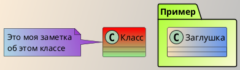
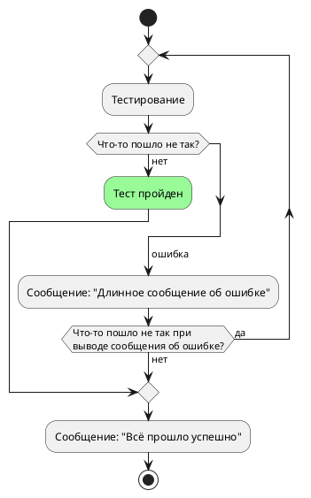

# ЗАГОЛОВКИ
## {.tabset}

### Использование
Использование от 1 до 6 символов хэштег (#), за которым следует пробел, перед выбором текста.

### Пример
```
# Заголовок 1 уровня
## Заголовок 2 уровня
### Заголовок 3 уровня
#### Заголовок 4 уровня
##### Заголовок 5 уровня
###### Заголовок 6 уровня
```

<br>

# ТЕКСТ
## {.tabset}

### Использование
**Жирный**
*Курсив*
_Подчёркнутый_
~~Зачёркнутый~~
^Надстрочный^ текст
~Подстрочный~ текст

### Пример
```
**Жирный**						(Текст обрамляется символами: \*\*)

*Курсив*							(Текст обрамляется символом: \*)

_Подчёркнутый_				(Текст обрамляется символом: \_)

~~Зачёркнутый~~				(Текст обрамляется символами: \~\~)

^Надстрочный^ текст		(Текст обрамляется символом: \^)

~Подстрочный~ текст		(Текст обрамляется символом: \~)
```

<br>

# НЕУПОРЯДОЧЕННЫЕ СПИСКИ
## {.tabset}

### Использование
Использование символа звездочки (\*) или тире (-), за которым следует пробел, перед каждой строкой текста.

### Пример
- Маркированный неупорядоченный список 1
- Маркированный неупорядоченный список 2
* Маркированный неупорядоченный список 3
* Маркированный неупорядоченный список 4

```
- Маркированный неупорядоченный список 1
- Маркированный неупорядоченный список 2
* Маркированный неупорядоченный список 3
* Маркированный неупорядоченный список 4
```

### Дополнительно
Добавив класс на отдельной строке, после списка можно изменить вид списка:

- `links-list`
- `grid-list`

Например:
```
- Маркированный неупорядоченный список 1
- Маркированный неупорядоченный список 2
{.grid-list}

- [Название ссылки *Маркированный неупорядоченный список 3*](https://portal.bezant.ru/)
- [Название ссылки *Маркированный неупорядоченный список 4*](https://portal.bezant.ru/)
{.links-list}
```
Приведёт к:
- Маркированный неупорядоченный список 1
- Маркированный неупорядоченный список 2
{.grid-list}

и

- [Название ссылки *Маркированный неупорядоченный список 3*](https://portal.bezant.ru/)
- [Название ссылки *Маркированный неупорядоченный список 4*](https://portal.bezant.ru/)
{.links-list}

<br>

# ЭМОДЗИ
## {.tabset}

### Использование
Использование синтаксиса: **:emoji_name:**
Смотрите [Эмодзи](https://www.webfx.com/tools/emoji-cheat-sheet/) для полного списка возможных вариантов

### Пример
```
:apple:
:fire:
```
:apple:
:fire:
Для выбора эмодзи на Windows можно использовать сочетание клавиш <kbd>Win</kbd> + <kbd>; (Ж)</kbd>

<br>

# ГОРИЗОНТАЛЬНАЯ ЛИНИЯ
## {.tabset}

### Использование
Используйте символы тройного тире (---) на выделенной строке.

### Пример
Текст

---

Текст
```
Текст

---

Текст
```

<br>

# БЛОКИ КОДА
## {.tabset}

### Использование
Обрамление одиночным символом обратного апострофа (\`) выделяет выделенный текст в `код`.
Обрамление тройным символом обратного апострофа до и после выбора текста, на выделенных строках выделяет выделенный текст в блок кода.

### Пример
Встроенный `код` в текст обрамляется по одному символу (\`) в начале и в конце.

В то время как **блок кода** обрамляется тройным символом \`\`\`. Для примера возьмём данный код:

\`\`\`
function lorem (ipsum) {
    const dolor = 'consectetur adipiscing elit'
}
\`\`\`
```
function lorem (ipsum) {
    const dolor = 'consectetur adipiscing elit'
}
```

<br>

# ЦИТАТЫ ИЗ БЛОКОВ
## {.tabset}

### Использование
Использование символ "больше" (>), за которым следует пробел, перед каждой строкой текста.

### Пример
> \> Цитата

> \> Информация {.is-info} {.is-info}

> \> Успешно {.is-success} {.is-success}

> \> Предупреждение {.is-warning} {.is-warning}

> \> Ошибка {.is-danger} {.is-danger}

### Дополнительно
В некоторых случаях, используя синтаксис `{.class-name}` не применяет класс стиля к правильному элементу из-за неоднозначного содержания. Например:
> Текст
> - Список 1
> - Список 2
{.is-info}
```
> Текст
> - Список 1
> - Список 2
{.is-info}
```
Потому что парсер не знает, класс `.is-info` должен быть применён к списку или цитате из блока, в конечном итоге он применяется к неправильному элементу (самому глубокому элементу, предшествующему ему).

Вы можете указать правильную цель, используя синтаксис декорирования `<!-- {tag-name:.class-name} -->`. Например:
> Текст
> - Список 1
> - Список 2
<!-- {blockquote:.is-info} -->
```
> Текст
> - Список 1
> - Список 2
<!-- {blockquote:.is-info} -->
```
Класс `.is-info` теперь будет правильно применён к элементу блокчейн.

<br>

# ССЫЛКИ
## {.tabset}

### Использование
Использование синтаксиса [Текст ссылки](Источник ссылки).

### Пример
Перейдите по [ссылке](https://portal.bezant.ru/)
```
Перейдите по [ссылке](https://portal.bezant.ru/)
```

<br>

# ИЗОБРАЖЕНИЯ
## {.tabset}

### Использование
Использование синтаксиса `{.align-center}`

**Альтернативный текст изображения** - текст, который отображается, когда изображение не может быть загружено.
**Источник изображения** - путь файла изображения.
**Название изображения** - отображается, когда курсор пользователя находится над картинкой.
**=100x** или **=100%x** - размер изображения в пикселях или процентах.
**{.align-center}** - выравнивание по центру.

### Пример
{.align-center}
```
{.align-center}
```

<br>

# ТАБЛИЦЫ
## {.tabset}

### Использование
#### Простая таблица
| Заголовок A1 | Заголовок B1 | Заголовок C1 |
|--------------|--------------|--------------|
| Ячейка A2    | Ячейка B2    | Ячейка C2    |
| Ячейка A3    | Ячейка B3    | Ячейка C3    |

#### Сложная таблица:
| Заголовок A1   | Заголовок B1 | Заголовок C1    |
| :------------- | :----------: | --------------: |
|| Выравнивание |||
| По левому краю | По центру    | По правому краю |
| Ячейка A2      | Ячейка B2    | Ячейка C2       |
| Ячейка A3      | Ячейка B3    | Ячейка C3       |

### Пример
#### Простая таблица
```
| Заголовок A1 | Заголовок B1 | Заголовок C1 |
|--------------|--------------|--------------|
| Ячейка A2    | Ячейка B2    | Ячейка C2    |
| Ячейка A3    | Ячейка B3    | Ячейка C3    |
```

#### Сложная таблица:
```
| Заголовок A1   | Заголовок B1 | Заголовок C1    |
| :------------- | :----------: | --------------: |
|| Выравнивание |||
| По левому краю | По центру    | По правому краю |
| Ячейка A2      | Ячейка B2    | Ячейка C2       |
| Ячейка A3      | Ячейка B3    | Ячейка C3       |
```

<br>

# СПИСОК ЗАДАЧ
## {.tabset}

### Использование
Использование синтаксиса `- [ ]` или `- [x]`.

### Пример
- [x] Проверенный элемент задачи
- [x] Другой проверенный элемент задачи
- [ ] Непроверенный элемент задачи

```
- [x] Проверенный элемент задачи
- [x] Другой проверенный элемент задачи
- [ ] Непроверенный элемент задачи
```

<br>

# ВКЛАДКИ
## {.tabset}

### Использование
\# `{.tabset}`

\## Первая вкладка
Информация первой вкладки 

\## Вторая вкладка
Информация второй вкладки

\## Третья вкладка
Информация третьей вкладки

Обратите внимание, что вы можете использовать любой уровень заголовка, если заголовки детей на один уровень выше. Например, если родительский заголовок ### (H3), то заголовки вкладок должны быть #### (H4). Максимальный уровень заголовка для родителя - 5, а для ребёнка - 6.

### Пример
```
# {.tabset}

## Первая вкладка
Информация первой вкладки 

## Вторая вкладка
Информация второй вкладки

## Третья вкладка
Информация третьей вкладки
```
#### Вкладки {.tabset}

##### Первая вкладка
Информация первой вкладки 

##### Вторая вкладка
Информация второй вкладки

##### Третья вкладка
Информация третьей вкладки

<br>

# ТЕГИ
## {.tabset}

### Использование
Новая строка / Пустая строка: **\<br>**
Клавиатурные кнопки: <kbd>Esc</kbd>, <kbd>Enter</kbd> и другие.
Изменение цвета текста:
<span style="color: red;">Красный</span>, <span style="color: green;">Зелёный</span>, <span style="color: blue;">Синий</span>

### Пример
Новая строка / Пустая строка:
Текст<br>Текст
```
Текст<br>Текст
```

Пример клавиатурной кнопки:
Использование **\<kbd>** до и **\</kbd>** после выбранного текста , например <kbd>Enter</kbd>
```
<kbd>Enter</kbd>
```

Пример изменения цвета текста:
Использование **\<span style="color: ЦВЕТ;">** до и **\</span>** после выбранного текста, например <span style="color: green;">Зелёный</span>
```
<span style="color: green;">Зелёный</span>
```

<br>

# ДИАГРАММЫ PlantUML
## {.tabset}

### Использование
Использование блока кода с языком `plantuml`
Смотрите [Сайт PlantUML](https://plantuml.com/) для полного списка возможных вариантов
Для подробного изучения возможностей и синтаксиса языка обратитесь к [Справочному руководству по языку PlantUML](https://plantuml.com/ru/guide).

### Пример
```plantuml
"Пользователь 1" -> "Пользователь 2": Привет
"Пользователь 2" -> "Это что-то\nочень длинное" as Long
':
'"Пользователь 2" -> Long as "-\n"
Long --> "Пользователь 2": Ок
```
<br>

```plantuml
robust "SAP" as WB
concise "Транзакция" as WU
@0
WU is Пусто
WB is Пусто
@100
WU is Ожидание
WB is Обработка
@300
WB is Ожидание
```
<br>


<br>

